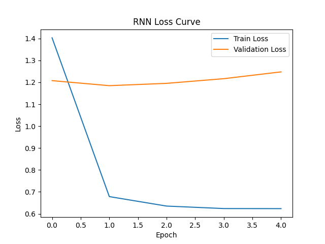
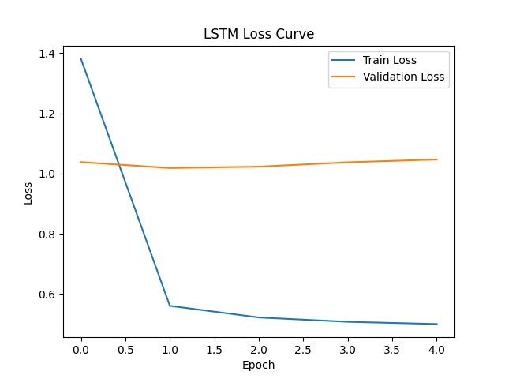
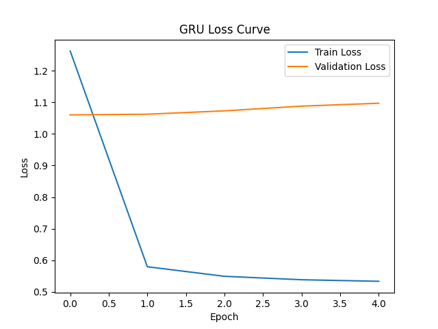
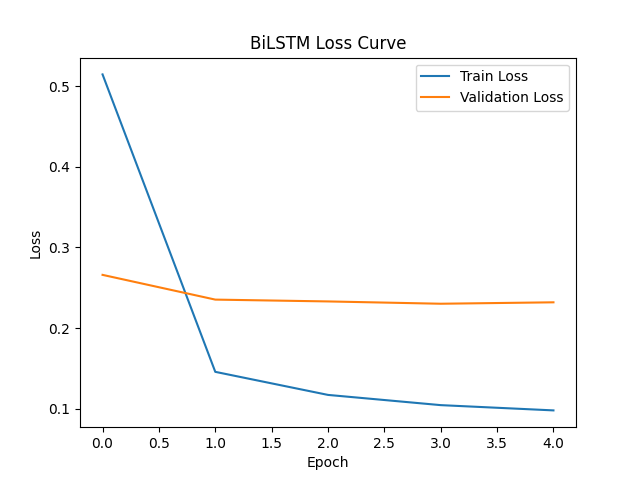
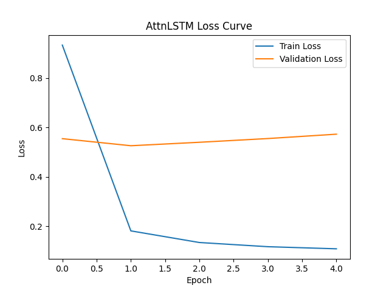
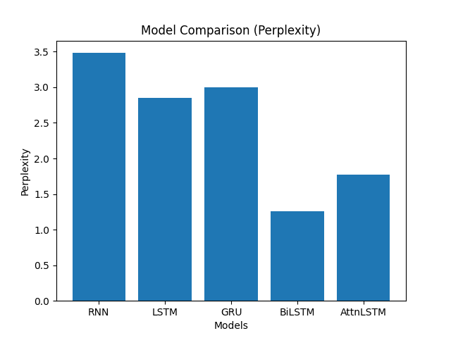
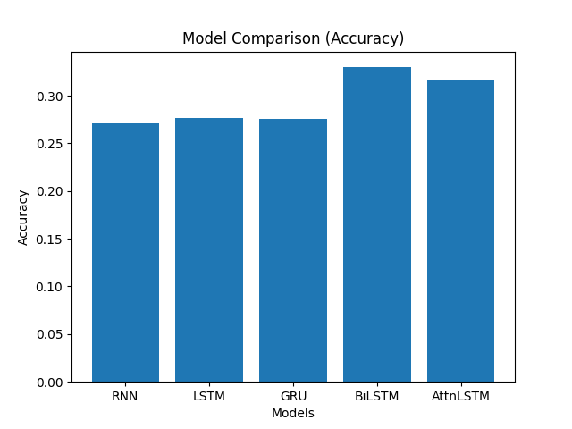

# Hindi Neural Language Model (RNN, LSTM, GRU, BiLSTM, Attention)

This project implements a Neural Language Model (NLM) for **next-word prediction in Hindi** using multiple recurrent architectures.

> Developed as part of the course **Natural Language Processing (DSE407)**.

---

## Overview

The objective is to model:

P(w_t | w_1, w_2, ..., w_{t-1})

i.e., predicting the next word given previous words.

---

## Dataset

We use the Hindi portion of:

- IIT Bombay English-Hindi Corpus

- Total dataset size: ~1.65M sentences  
- Used subset: **50,000 sentences**

### Preprocessing
- Removed English characters  
- Filtered non-Hindi symbols  
- Tokenized at word level  
- Kept sentences with length ≥ 5  

### Split
- Train: 40,000  
- Validation: 5,000  
- Test: 5,000  

---

## Models Implemented

- RNN  
- LSTM  
- GRU  
- BiLSTM  
- Attention-LSTM  

---

## Training Strategy

### Teacher Forcing

During training, the model is trained using **teacher forcing**, where ground truth tokens are fed as input.

### Autoregressive Generation

During inference, the model generates text **autoregressively**, feeding its own predictions back as input.

---

## Evaluation Metrics

### Accuracy
Token-level prediction accuracy.

### Perplexity
Perplexity = exp(loss)

Lower perplexity indicates better performance.

---

## Results

| Model      | Accuracy | Perplexity |
|-----------|---------|------------|
| RNN       | 0.2641  | 3.36       |
| LSTM      | 0.2692  | 2.74       |
| GRU       | 0.2690  | 2.86       |
| BiLSTM    | 0.3227  | 1.25       |
| AttnLSTM  | 0.3095  | 1.68       |

---

## Loss Curves

### RNN


### LSTM


### GRU


### BiLSTM


### Attention LSTM


---

## Model Comparison

### Perplexity


### Accuracy


---

## Observations

- RNN performs worst due to lack of long-term memory  
- LSTM and GRU improve performance via gating mechanisms  
- BiLSTM achieves best results using bidirectional context  
- Attention improves contextual understanding over standard LSTM  

---

## Key Insight

BiLSTM performs best but uses future context, making it less suitable for strict autoregressive generation.

---

## Sample Generation

Example:

Input:  
"मैं आज"

Output:  
"मैं आज किए जाने वाले कार्य को हाईलाइट करें कृपया सही पर सेट करें"

---

## How to Run

```bash
git clone https://github.com/nikunj-indoriya/hindi-neural-language-model
cd hindi-neural-language-model
pip install -r requirements.txt
python main.py
````

---

## Authors

* Nikunj Indoriya 